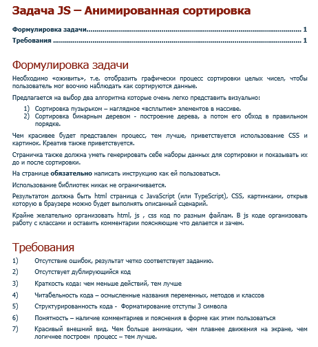

Тестовое задание от Tensor UFA

Задача JS – Анимированная сортировка
Необходимо «оживить», т.е. отобразить графически процесс сортировки целых чисел, чтобы пользователь мог воочию наблюдать как сортируются данные. 

<a href="https://osdnyasha.github.io/animateBubbleSort/">Online demo</a>

